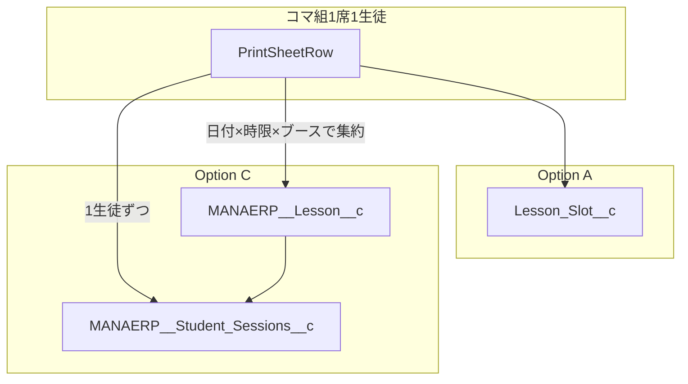

# MANAERP Lesson マッピング調査（スパイク）

**調査日**: 2026-06-20  
**対象 org**: `trg2--extuat`  
**データソース**: `scripts/discover-lesson-objects.py` → `apps/extension/data/discovery-trg2-extuat.json`

## 結論

| オプション | 概要 | 推奨 |
|-----------|------|------|
| **A** | `Lesson_Slot__c` のみ（Excel F19 互換） | **Phase 2D MVP（採用）** |
| **B** | `Lesson_Slot__c` + 夜間/バッチで MANAERP へ変換 | 中間層。Manabie 標準レポート連携が必要になったら検討 |
| **C** | フル移行（コマ組 → Lesson + Student_Session 直書き） | 工数大。ブース/席モデルの再設計が前提 |

MANAERP `Lesson` への置き換えは**技術的に可能**だが、PrintSheet の「1行=1席1生徒」とは**データ粒度が異なる**ため drop-in 置換ではない。

## オブジェクト比較（extuat describe）

### `Lesson_Slot__c`（TRG 独自・26フィールド）

コマ組 PrintSheet と 1:1 対応するフィールドが揃っている。

| コマ組 | フィールド | 型 |
|--------|-----------|-----|
| 日付 | `Date__c` | date |
| 時限 | `Period__c` | double |
| ブース | `Booth__c` | double |
| 生徒名 | `Student_Name__c` | string |
| 教科 | `Subject__c` | string |
| 出欠 | `Attendance__c` | picklist（出席/欠席/振替） |
| 形式 | `Capacity__c` | picklist（1：1 / 1：2） |
| 拠点 | `Account__c` | lookup |
| External ID | `Slot_Key__c` | string |

### `MANAERP__Lesson__c`（Manabie 標準・54フィールド）

**1レコード = 授業セッション**（Schedule / Timeslot から派生）。

| 関連概念 | フィールド | 備考 |
|---------|-----------|------|
| 授業日 | `MANAERP__Lesson_Date__c` | date |
| 開始/終了 | `MANAERP__Start_Date_Time__c`, `MANAERP__End_Date_Time__c` | datetime |
| テンプレ | `MANAERP__Lesson_Schedule__c` | lookup |
| 時限 | `MANAERP__Timeslot__c` | lookup（ブース番号ではない） |
| 定員 | `MANAERP__Lesson_Capacity__c` | double |
| 科目 | `MANAERP__Subject_Name__c` | string |

**ブース・席番号のフィールドは存在しない。**

### `MANAERP__Student_Sessions__c`（49フィールド）

生徒・出欠は **Lesson の子レコード**。

| コマ組概念 | フィールド | 備考 |
|-----------|-----------|------|
| 親授業 | `MANAERP__Lesson__c` | lookup |
| 生徒 | `MANAERP__Student__c` | lookup（Contact/Student） |
| 生徒名（表示） | `MANAERP__Student_Name__c` | string |
| 出欠 | `MANAERP__Attendance_Status__c` | picklist |
| 複合キー | `MANAERP__Lesson_Student_Composite_Key__c` | 一意性候補 |

## コマ組 → MANAERP 写像ギャップ

| ギャップ | 詳細 | 対応案 |
|---------|------|--------|
| ブース | MANAERP にブース概念なし | 教室 junction またはカスタムフィールド追加が必要 |
| 席（1/2） | Student_Session に席番号なし | 2席を同一 Lesson にまとめるルール設計 |
| 集約キー | 2行（席1/席2）→ 1 Lesson | `{date}_{period}_{booth}` でグループ化 |
| Schedule 連携 | Lesson は Schedule 派生が前提 | 未登録時の Schedule 自動作成ポリシー要定義 |
| 生徒解決 | テキスト名 → `MANAERP__Student__c` | F14 マスタ同期（students カタログ）で ID 解決 |
| 出欠 picklist | `Attendance__c` vs `MANAERP__Attendance_Status__c` | 値マッピング表が必要（未確定/休講は SF 側に無い場合あり） |
| 振替 | TRG は `transferFrom/To` をセルに保持 | Reallocation / Lesson_Allocation 系の要否を Manabie 側と確認 |

## 移行オプション詳細

### A: Lesson_Slot__c のみ（現行）

- Phase 2D で実装済み（`slotImportPlanBuilder.ts` + composite upsert）
- Excel F19 / `M19_SfdcSync.bas` と `Slot_Key__c` 形式を共有
- Manabie 標準の授業レポートとは別データ経路

### B: 中間層（Lesson_Slot → MANAERP 変換）

- コマ組ツールは引き続き `Lesson_Slot__c` に upsert
- Apex / バッチ / MuleSoft で `Lesson` + `Student_Session` を生成
- TRG 独自ロジックを SF 側に閉じ込められる
- 二重管理期間の整合性監視が必要

### C: フル移行

- 拡張の ImportPlan を Lesson + Student_Session バッチに再設計
- 見積: discovery 拡張 + 集約ロジック + UI 変更 + E2E + 既存 Excel との互換方針
- **Phase 2E 以降の別フェーズ**として扱うのが妥当

## 次のアクション（MANAERP ルートを進める場合）

1. TRG 業務担当と「ブース→教室/時限」の対応ルールを合意
2. `MANAERP__Attendance_Status__c` の許容値と TRG 出欠（未確定/休講含む）のマッピング表作成
3. サンプル週の SOQL で親子構造を実データ確認（`Lesson` + `Student_Sessions__r`）
4. Option B vs C の工数見積と、Manabie 標準レポート要件の優先度確認

## 参照

- [phase2-booth-grid-design.md](./phase2-booth-grid-design.md) — 2D スコープ
- [lesson-manage F_survey.md](file:///Users/andokohei/Documents/dev/sfdev/TRG-PROJECT/lesson-manage/excel-vba/specs/F_survey.md) — Lesson_Slot フィールド確認
- `apps/extension/data/discovery-trg2-extuat.json` — 最新 describe
