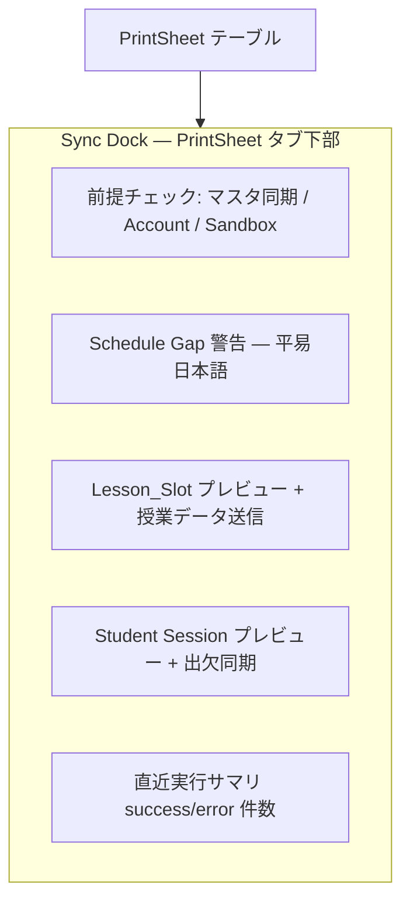

# Phase 4 UX Review — Codex G0（IA + Sync Dock ワイヤ）

**日付:** 2026-06-20  
**ゲート:** G0（Part A 着手前）  
**合格基準:** 「コマ組 → 同期 → 報告」が 3 クリック以内で説明できる

## 結論

**合格。** タブを日常タスク順に並べ替え、PrintSheet 下部に Sync Dock を 1 つだけ置くことで、教室長の主フローが同一タブ内で完結する。

## 現状の摩擦（G0 入力）

| 問題 | 影響 |
|------|------|
| SF 同期 UI が「登録内容の確認」タブのみ | PrintSheet 確認後にタブ移動が必要 |
| PrintSheet と preview で同期 UI 重複 | どこで実行するか迷う |
| ネイティブ prompt/confirm/alert | Sandbox フレーズ入力が不安・誤操作リスク |
| booth と dashboard で SF クエリ二重 | 週 gap 表示が遅く、結果がずれる可能性 |

## 採用 IA（タブ順）

```text
[コマ組] [PrintSheet] [回数報告] [授業スケジュール] [休校日] [Manabie登録]
```

| 旧名称 | 新名称 | 役割 |
|--------|--------|------|
| 登録内容の確認 | **Manabie登録** | 授業スケジュール ImportPlan + 休校日登録のみ（同期 UI なし） |
| （順序変更） | コマ組を先頭 | 日常の起点 |

## Sync Dock ワイヤ（PrintSheet 下部）



## ユーザーフロー 3 本（3 クリック以内）

### フロー 1: コマ入力 → SF 同期

1. **コマ組** — 週を選び生徒を入力（既存）
2. **PrintSheet** — 行を確認（タブ切替 1 回）
3. Sync Dock **授業データ送信** — モーダルで `EXECUTE SANDBOX` 入力して実行

→ 同期まで **タブ 2 枚 + 実行 1 クリック**（同一 PrintSheet タブ内）

### フロー 2: 出欠同期（3B）

1. PrintSheet で出欠を編集
2. Sync Dock **Manabie 出欠同期** — モーダル確認 → 実行
3. （任意）SF 列バッジ「同期済」確認

→ **同一タブ内 1 クリック + モーダル確認**

### フロー 3: 回数報告

1. **回数報告** — 生徒選択 → 更新
2. F13 未同期時 — 「PrintSheet の Sync Dock へ」リンクでジャンプ
3. Sync Dock または回数報告で F13 実行

→ **最大 3 クリック**（報告タブ → リンク → 同期）

## G0 で Phase 5 に defer

- 仮想スクロール（DOM 量問題顕在化後）
- Production 書き込み
- paidKomaField / Student_Session create
- 振替・休講 → Manabie write

## 実装メモ（Part A 以降）

- `manabieQueryCache` で session + gap クエリを dashboard 一元化
- `confirm-modal.ts` / `toast.ts` でネイティブ dialog ゼロ化（G1 検証）
- ヘッダー下 `setup-checklist` で未完了導線を集約
